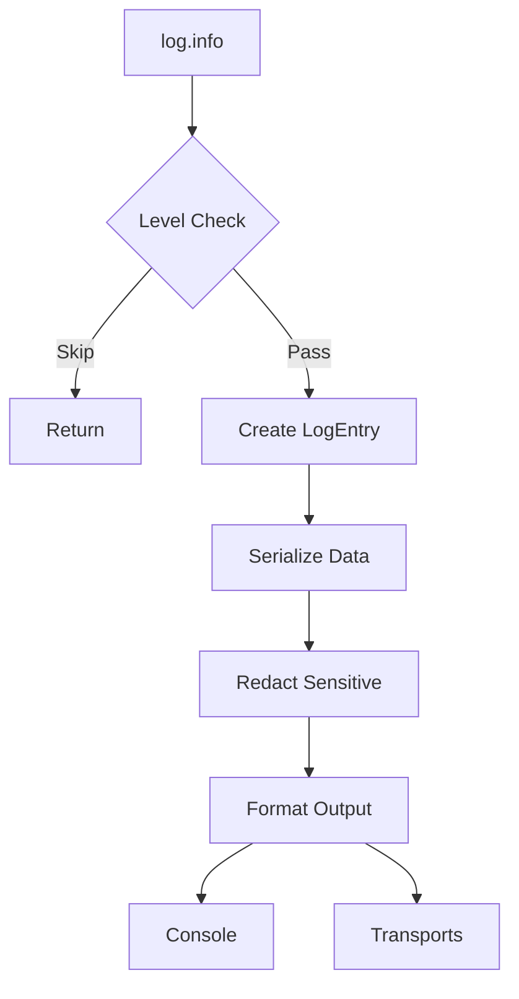
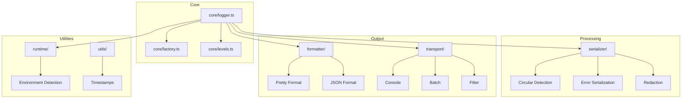
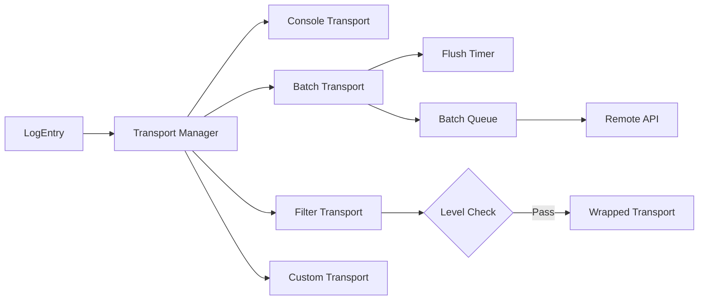

# Architecture

This document explains how `@nextrush/log` works internally.

## High-Level Overview

```
┌─────────────────────────────────────────────────────────────────┐
│                         Your Application                         │
└─────────────────────────────────────────────────────────────────┘
                                │
                                ▼
┌─────────────────────────────────────────────────────────────────┐
│                        createLogger()                            │
│  ┌─────────────┐  ┌─────────────┐  ┌─────────────┐              │
│  │   context   │  │   options   │  │  metadata   │              │
│  └─────────────┘  └─────────────┘  └─────────────┘              │
└─────────────────────────────────────────────────────────────────┘
                                │
                                ▼
┌─────────────────────────────────────────────────────────────────┐
│                         Logger Instance                          │
│                                                                  │
│   log.info()  log.error()  log.debug()  log.warn()  ...         │
└─────────────────────────────────────────────────────────────────┘
                                │
                                ▼
┌─────────────────────────────────────────────────────────────────┐
│                         Log Pipeline                             │
│                                                                  │
│   1. Level Check    →  Skip if below minLevel                   │
│   2. Build Entry    →  timestamp, level, message, data          │
│   3. Serialize      →  Safe handling of objects, errors         │
│   4. Redact         →  Remove sensitive data                    │
│   5. Format         →  Pretty (dev) or JSON (prod)              │
│   6. Output         →  Console + Custom Transports              │
└─────────────────────────────────────────────────────────────────┘
```

## Log Flow (Mermaid)



## Module Structure



## Directory Structure

```
src/
├── core/           # Logger class and factory
│   ├── logger.ts   # Main Logger implementation
│   ├── factory.ts  # createLogger function
│   └── levels.ts   # Log levels (trace → fatal)
│
├── serializer/     # Data processing
│   ├── serialize.ts    # Safe object serialization
│   ├── redact.ts       # Sensitive data removal
│   └── error.ts        # Error stack handling
│
├── formatter/      # Output formatting
│   ├── pretty.ts   # Human-readable (development)
│   └── json.ts     # Structured JSON (production)
│
├── transport/      # Output destinations
│   ├── console.ts  # Console output
│   ├── batch.ts    # Batched sending
│   └── filter.ts   # Level filtering
│
├── runtime/        # Environment detection
│   └── detect.ts   # Node/Browser/Edge detection
│
├── browser/        # Browser-specific utilities
│   └── index.ts    # Error capture, beacon transport
│
├── react/          # React integration
│   └── index.tsx   # Provider, hooks, ErrorBoundary
│
├── types/          # TypeScript definitions
│   └── index.ts    # All type exports
│
└── index.ts        # Main entry point
```

## Log Entry Structure

```typescript
interface LogEntry {
  timestamp: string;      // ISO 8601
  level: LogLevel;        // 'trace' | 'debug' | 'info' | 'warn' | 'error' | 'fatal'
  context: string;        // Logger name
  message: string;        // Log message
  data?: object;          // Structured data
  error?: {               // Error details
    name: string;
    message: string;
    stack?: string;
  };
  correlationId?: string; // Request tracing
  metadata?: object;      // Additional context
  runtime: string;        // 'node' | 'browser' | 'edge' | etc.
}
```

## Level Priority

```
┌──────────┬──────────┬─────────────────────────────────┐
│  Level   │ Priority │ Use Case                        │
├──────────┼──────────┼─────────────────────────────────┤
│  trace   │    0     │ Very detailed debugging         │
│  debug   │    1     │ Debug information               │
│  info    │    2     │ General information             │
│  warn    │    3     │ Warnings                        │
│  error   │    4     │ Errors (recoverable)            │
│  fatal   │    5     │ Critical errors (app crash)     │
└──────────┴──────────┴─────────────────────────────────┘
```

## Transport System



## Serialization Pipeline

```
Input Object
     │
     ▼
┌─────────────────┐
│ Circular Check  │──▶ Replace with "[Circular]"
└─────────────────┘
     │
     ▼
┌─────────────────┐
│  Depth Check    │──▶ Stop at maxDepth
└─────────────────┘
     │
     ▼
┌─────────────────┐
│  Type Handler   │──▶ Error, Map, Set, Date, etc.
└─────────────────┘
     │
     ▼
┌─────────────────┐
│  Redaction      │──▶ Replace sensitive keys
└─────────────────┘
     │
     ▼
Safe Output
```

## Environment Detection

The logger automatically detects the runtime:

```typescript
// Detection order
1. window + document  → 'browser'
2. Deno.version       → 'deno'
3. Bun.version        → 'bun'
4. EdgeRuntime        → 'edge'
5. process.versions   → 'node'
6. fallback           → 'unknown'
```

## Performance Considerations

1. **Level Check First**: Skip processing if level is below minimum
2. **Lazy Serialization**: Only serialize when needed
3. **Circular Detection**: O(n) with WeakSet
4. **No Dependencies**: Zero external packages
5. **Tree-Shakeable**: Only import what you use

## See Also

- [API Reference](./api.md)
- [Getting Started](./getting-started.md)
- [Examples](./examples.md)
