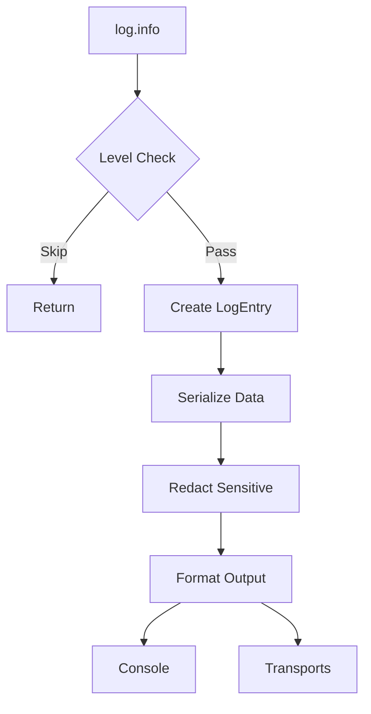
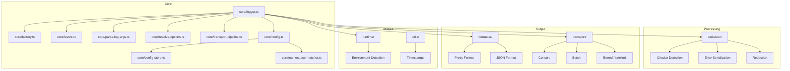
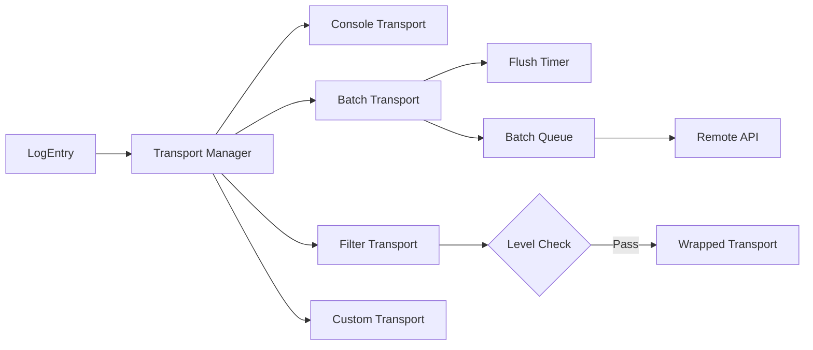

# Architecture

This document explains how `@nextrush/log` works internally.

## High-Level Overview

```
┌─────────────────────────────────────────────────────────────────┐
│                         Your Application                         │
└─────────────────────────────────────────────────────────────────┘
                                │
                                ▼
┌─────────────────────────────────────────────────────────────────┐
│                        createLogger()                            │
│  ┌─────────────┐  ┌─────────────┐  ┌─────────────┐              │
│  │   context   │  │   options   │  │  metadata   │              │
│  └─────────────┘  └─────────────┘  └─────────────┘              │
└─────────────────────────────────────────────────────────────────┘
                                │
                                ▼
┌─────────────────────────────────────────────────────────────────┐
│                         Logger Instance                          │
│                                                                  │
│   log.info()  log.error()  log.debug()  log.warn()  ...         │
└─────────────────────────────────────────────────────────────────┘
                                │
                                ▼
┌─────────────────────────────────────────────────────────────────┐
│                         Log Pipeline                             │
│                                                                  │
│   1. Level Check    →  Skip if below minLevel                   │
│   2. Build Entry    →  timestamp, level, message, data          │
│   3. Serialize      →  Safe handling of objects, errors         │
│   4. Redact         →  Remove sensitive data                    │
│   5. Format         →  Pretty (dev) or JSON (prod)              │
│   6. Output         →  Console + Custom Transports              │
└─────────────────────────────────────────────────────────────────┘
```

## Log Flow (Mermaid)


```mermaid
flowchart TD
    A[log.info] --> B{Level Check}
    B -->|Skip| C[Return]
    B -->|Pass| D[Create LogEntry]
    D --> E[Serialize Data]
    E --> F[Redact Sensitive]
    F --> G[Format Output]
    G --> H[Console]
    G --> I[Transports]
```

## Module Structure


```mermaid
graph TB
    subgraph Core
        A[core/logger.ts] --> B[core/factory.ts]
        A --> C[core/levels.ts]
        A --> P[core/parse-log-args.ts]
        A --> R[core/resolve-options.ts]
        A --> T[core/transport-pipeline.ts]
        A --> CFG[core/config.ts]
        CFG --> CS[core/config-store.ts]
        CFG --> NM[core/namespace-matcher.ts]
    end

    subgraph Processing
        D[serializer/] --> E[Circular Detection]
        D --> F[Error Serialization]
        D --> G[Redaction]
    end

    subgraph Output
        H[formatter/] --> I[Pretty Format]
        H --> J[JSON Format]
        K[transport/] --> L[Console]
        K --> M[Batch]
        K --> N[filtered / ratelimit]
    end

    subgraph Utilities
        O[runtime/] --> Q2[Environment Detection]
        Q[utils/] --> R2[Timestamps]
    end

    A --> D
    A --> H
    A --> K
    A --> O
```

## Directory Structure

```
src/
├── core/                    # Logger class and global configuration
│   ├── logger.ts            # Logger class — a thin facade delegating to the below
│   ├── factory.ts           # createLogger function
│   ├── parse-log-args.ts    # Flexible (message, data, error) argument parsing
│   ├── resolve-options.ts   # Option/environment resolution, child-option derivation
│   ├── transport-pipeline.ts # Transport execution (global + instance transports)
│   ├── config.ts            # Global config: configure()/disableLogging()/etc.
│   ├── config-store.ts      # createConfigStore() factory backing global config
│   ├── namespace-matcher.ts # Shared, ReDoS-guarded namespace glob matching
│   └── levels.ts            # Log levels (trace → fatal)
│
├── serializer/     # Data processing
│   ├── serialize.ts    # Safe object serialization (dispatches by type)
│   ├── collections.ts  # Map/Set/Array serializers
│   ├── redaction.ts    # Sensitive data removal (whole-token key matching)
│   └── error.ts        # Error serialization (single source, used everywhere)
│
├── formatter/      # Output formatting
│   ├── pretty.ts   # Terminal human-readable (message sanitized before output)
│   ├── json.ts     # Structured JSON
│   └── browser.ts  # Browser console (CSS), message never fed into the format string
│
├── transport/      # Output destinations
│   ├── console.ts   # Console output (built into every Logger — do not add as a transport)
│   ├── batch.ts     # Batched sending
│   ├── filtered.ts  # Level-based filtering
│   └── ratelimit.ts # Token-bucket rate limiting
│
├── runtime/        # Environment detection
│   └── index.ts    # Node / browser / Deno / Bun / edge detection
│
├── context/        # Async correlation-ID/metadata propagation
│   ├── index.ts               # Public runWithContext/getAsyncContext/middleware
│   ├── async-local-storage.ts # AsyncLocalStorage loading (ESM-safe)
│   ├── fallback-stack.ts      # Scoped fallback for runtimes without ALS
│   └── types.ts
│
├── browser/        # Browser-specific utilities
│   ├── index.ts             # Barrel
│   ├── environment.ts       # isBrowser/isServer/isOnline
│   ├── error-capture.ts     # window.onerror / unhandledrejection capture
│   ├── beacon-transport.ts  # navigator.sendBeacon transport
│   ├── lifecycle.ts         # Flush-on-unload
│   └── setup.ts             # setupBrowserLogging() orchestrator
│
├── react/          # React integration
│   └── index.tsx   # Provider, hooks, ErrorBoundary
│
├── testing/        # Mock logger + assertions (@nextrush/log/testing)
│   └── index.ts
│
├── utils/          # Small shared primitives
│   ├── time.ts            # Timestamp formatting
│   ├── colors.ts          # ANSI/terminal colors
│   ├── console-method.ts  # Single console-method resolver (used by transport + formatter)
│   └── level-icons.ts      # Shared level icon glyphs
│
├── types/          # TypeScript definitions
│   └── index.ts    # All type exports
│
└── index.ts        # Main entry point — minimal public surface (~20 exports)
```

## Log Entry Structure

```typescript
interface LogEntry {
  timestamp: string;      // ISO 8601
  level: LogLevel;        // 'trace' | 'debug' | 'info' | 'warn' | 'error' | 'fatal'
  context: string;        // Logger name
  message: string;        // Log message
  data?: object;          // Structured data (metadata merged here)
  error?: {               // Error details
    name: string;
    message: string;
    stack?: string;
  };
  correlationId?: string; // Request tracing
  performance?: { duration?: number }; // e.g. timer.end()
  runtime: string;        // 'node' | 'browser' | 'edge' | etc.
}
```

## Level Priority

```
┌──────────┬──────────┬─────────────────────────────────┐
│  Level   │ Priority │ Use Case                        │
├──────────┼──────────┼─────────────────────────────────┤
│  trace   │    0     │ Very detailed debugging         │
│  debug   │    1     │ Debug information               │
│  info    │    2     │ General information             │
│  warn    │    3     │ Warnings                        │
│  error   │    4     │ Errors (recoverable)            │
│  fatal   │    5     │ Critical errors (app crash)     │
└──────────┴──────────┴─────────────────────────────────┘
```

## Transport System


```mermaid
flowchart LR
    A[LogEntry] --> B[Transport Manager]
    B --> C[Console Transport]
    B --> D[Batch Transport]
    B --> E[Filter Transport]
    B --> F[Custom Transport]

    D --> G[Flush Timer]
    D --> H[Batch Queue]
    H --> I[Remote API]

    E --> J{Level Check}
    J -->|Pass| K[Wrapped Transport]
```

## Serialization Pipeline

```
Input Object
     │
     ▼
┌─────────────────┐
│ Circular Check  │──▶ Replace with "[Circular]"
└─────────────────┘
     │
     ▼
┌─────────────────┐
│  Depth Check    │──▶ Stop at maxDepth
└─────────────────┘
     │
     ▼
┌─────────────────┐
│  Type Handler   │──▶ Error, Map, Set, Date, etc.
└─────────────────┘
     │
     ▼
┌─────────────────┐
│  Redaction      │──▶ Replace sensitive keys
└─────────────────┘
     │
     ▼
Safe Output
```

## Environment Detection

The logger automatically detects the runtime. Detection is priority-ordered — the first
matching signal wins:

```typescript
// Detection priority (first match wins)
1. React Native globals → 'react-native'
2. window + document    → 'browser'
3. Worker self context  → 'worker'
4. Edge runtime globals → 'edge'   (e.g. EdgeRuntime, Cloudflare Workers)
5. Deno.version         → 'deno'
6. Bun.version          → 'bun'
7. process.versions     → 'node'
8. fallback             → 'unknown'
```

## Performance Considerations

1. **Level Check First**: Skip processing if level is below minimum
2. **Lazy Serialization**: Only serialize when needed
3. **Circular Detection**: O(n) with WeakSet
4. **No Dependencies**: Zero external packages
5. **Tree-Shakeable**: Only import what you use

## See Also

- [API Reference](./api.md)
- [Getting Started](./getting-started.md)
- [Examples](./examples.md)
